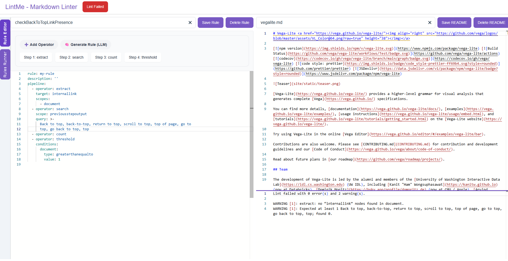
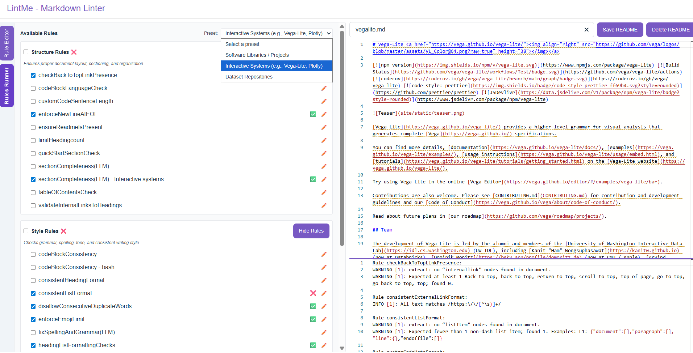
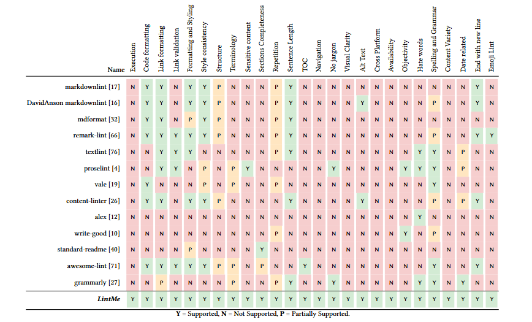

# LintMe - Markdown Linter
LintMe is a Markdown linting tool focused on README files, designed to help users detect, fix, and improve documentation quality through a combination of rule-based checks, customizable operators, and LLM-powered suggestions.
<p align="center">
  
  
</p>

## Table of Contents
- [Introduction](#introduction)
- [How to install](#how-to-install)
- [Related work](#related-work)
- [Quick Start](#quick-start)
- [Related Work](#related-work)
- [Porject Status](#project-status)
- [Project Plans](#project-plans)

## Introduction
LintMe is a Markdown linter that helps maintainers and contributors keep documentation clear, complete, and runnable by combining fast, programmatic checks with targeted LLM judgments. It catches style issues (e.g., broken links, code-fence integrity) and content problems (e.g., jargon-heavy language), and lets you adapt rules to your context using lightweight, composable operators.

LintMe enables presets(sets of rules) and rule-level customization so your README passes the standards that matter in your field.

## How to install

### Requirements
- **Node.js 18+** (for global `fetch`)
- **npm**, **yarn**, or **pnpm**

Check your Node version:
```bash
node -v
```

### Global install (recommended)
```bash
npm i -g lintme-cli
# or
yarn global add lintme-cli
# or
pnpm add -g lintme-cli
```

Verify:
```bash
lintme --help
```

### Local (per-project) install
```bash
npm i -D lintme-cli
# or
yarn add -D lintme-cli
# or
pnpm add -D lintme-cli
```

Run with npx:
```bash
npx lintme --help
```

---
## Quick start

Please follow [Global install (recommended)](#global-install-recommended) so the `lintme` command is available in your shell.

### Apply a single rule to a Markdown file
Please replace lintrule.yaml and Readme.md with actual paths to yaml rules and markdown file.

Note: Sample yaml rules and markdowns are present in `apps\lintme-ui\examples`, but we will be updating the complete list.
```bash
lintme run --rule lintrule.yaml --in README.md
```

### Run multiple rules
Repeat `--rule`:
```bash
lintme run \
  --rule lintrule-1.yaml \
  --rule lintrule-2.yaml \
  --in README.md
```
### List presets
Please replace rulePresets.js with actual paths to the preset file. It is present at `apps\lintme-ui\src\lib\rulePresets.js`
```bash
lintme run --list-presets --presets rulePresets.js
```

### Apply a preset 
Please replace the preset name using the option `--preset` and provide path to the location of yaml rules folder in `--rules-dir`
```bash
lintme run \
  --preset software \
  --presets rulePresets.js \
  --rules-dir ./rules \
  --in README.md
```

### Apply fixes
Print only the fixed Markdown to stdout:
```bash
lintme run -r lintrule.yaml --in README.md --fix
```

Write the fixed Markdown back to the file (this will override the contents of the original markdown):
```bash
lintme run -r lintrule.yaml --in README.md --write
```

### Alternative: use `npx` (without global install)
```bash
npx lintme-cli run --rule lintrule.yaml --in README.md
```

---

## Related work 
Documentation quality strongly influences usability and onboarding. Existing linters cover pieces of the problem:
- **Structure/format:** `markdownlint`, `remark-lint`, `mdformat`
- **Language/style & inclusivity:** `proselint`, `write-good`, `textlint`, `alex`, Grammarly
- **Docs- or domain-specific:** GitHub `content-linter`, `standard-readme`, `awesome-lint`, `commitlint`, job post linters
- **Automated/LLM-based assessment:** recent systems score or fix docs, but are often fixed-rule or narrow in scope

**LintMe** generalizes this space by letting users compose **programmatic operators** with **optional LLM checks and fixes**, so projects can enforce standards that match their context rather than a one-size-fits-all rule set.



## Project Status 
The tool is deployed and available to use at [Tool link](https://lintme.netlify.app/)
## Project Plans
This is a prototype to demonstrate the idea; we’re in the process of publishing and iterating, so rule formats, and defaults may change—please try it on sample READMEs (not production ready yet) and share feedback/issues to help prioritize more preset rule packs, stronger checks and fixes

## Contributors to the project 
`To be updated`

## Documentation links
The md files in this repository serve as a documentation to the tool. Link to a live demo `To be updated`

## Citation 
`To be updated`

## Contributions
`To be updated`

## Licensing
`To be updated`